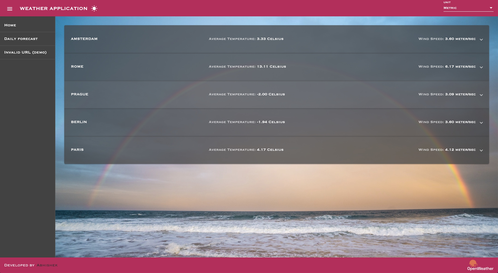

# Weather Application

This project was generated with [Angular CLI](https://github.com/angular/angular-cli) version 11.2.4.

## Summary

This is a weather application that uses the [Ppenweather API](https://openweathermap.org/api) to display weather data.
This uses Angular 11 to make the frontend.
A demo can be seen at [https://abhishekkrmehta.github.io/weather-app/](https://abhishekkrmehta.github.io/weather-app/)

## Development server

- Install Angular CLI and Node.js
- Navigate to the project directory and run `npm install`
- Run `ng serve` for a dev server. Navigate to `http://localhost:4200/`. The app will automatically reload if you change any of the source files.

## Deployment

This application is deployed using github pages on [https://abhishekkrmehta.github.io/weather-app/](https://abhishekkrmehta.github.io/weather-app/).

## Can be improved

- make the app responsive
- improve unit test coverage
- remove unusedd imports/variables

## Running unit tests

Run `ng test` to execute the unit tests via [Karma](https://karma-runner.github.io).

## Author

This app was built by Abhishek.
You can view my portfolio site at: `http://abhishekmehta.co/`
